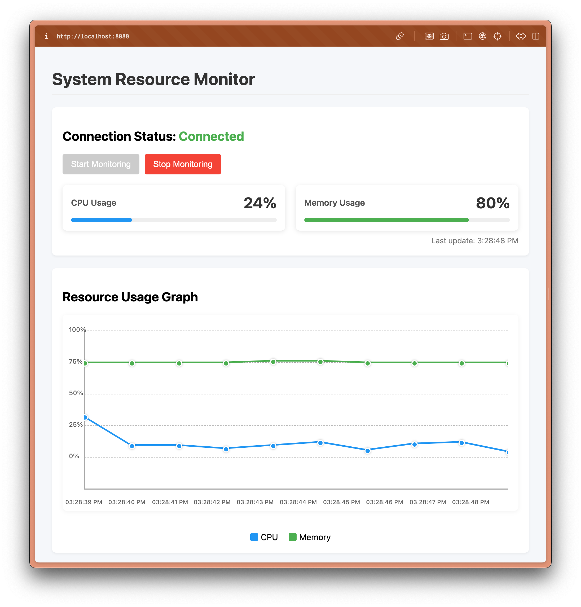

# Server-Sent Events (SSE) Example

This example demonstrates how to implement Server-Sent Events (SSE) in a Goa
service to stream real-time system monitoring data (CPU and memory usage) to
clients. 

SSE is a server push technology that enables a client to receive automatic
updates from a server via an HTTP connection. Unlike WebSockets, SSE is a
one-way communication channel (server to client only), making it ideal for
real-time monitoring dashboards and live data feeds.

## Overview

This example includes:

1. A Goa service with a single SSE endpoint:
   - `monitor`: An SSE endpoint that clients connect to for receiving real-time system metrics (CPU and memory usage)

2. A web-based client interface for testing the SSE functionality


> **Requirements:**
> - This example requires Goa v3.20.2 or higher for SSE support.

The primary focus is streaming live system metrics to demonstrate SSE in a
practical monitoring scenario.

## Running the Example

### Build and Start the Server

```bash
# Build the server (important: from the root of the example directory)
go build -o ./cmd/monitor/monitor goa.design/examples/sse/cmd/monitor

# Run the server
./cmd/monitor/monitor --http-port 8080
```

### Open the Web Client

Once the server is running, open your browser and navigate to:

http://localhost:8080/

You should see a web interface displaying real-time CPU and memory usage.



*Note: The screenshot is for documentation only and is not included in the embedded assets or the Go binary.*

You'll see a web interface with the following features:
- A "Connect" button to establish an SSE connection
- A real-time display of CPU and memory usage streamed from the server
- An event log showing all received events

> **Note:**: If you see a blank page or a 404 error, make sure the server was
> compiled from the root of the example directory so that the embedded static
> files are available, see [Serving the Embedded Web Client](#serving-the-embedded-web-client)
> below.

### Using the Generated CLI Client

Goa generates a command-line client (`monitor-cli`) that can connect to the
SSE endpoint and stream events directly in your terminal. This is useful for
testing, automation, or consuming SSE APIs from scripts.

#### Build the CLI Client

```bash
# From the example directory
go build -o ./cmd/monitor-cli/monitor-cli goa.design/examples/sse/cmd/monitor-cli
```

#### Connect to the SSE Endpoint

```bash
./cmd/monitor-cli/monitor-cli monitor monitor --url http://localhost:8080
```

You should see a stream of JSON objects representing CPU and memory usage,
updated in real time. The CLI client is fully generated by Goa and supports
streaming output for SSE endpoints.

## Implementation Details

### Service Design

The service is defined in `design/design.go` with a single main endpoint:

```go
var _ = Service("monitor", func() {
    Description("The monitor service provides real-time system monitoring via SSE")

    Method("monitor", func() {
        Description("Monitor CPU and memory usage via Server-Sent Events")
        StreamingResult(Usage) // Enables streaming responses
        HTTP(func() {
            GET("/monitor") // Exposes at GET /monitor
            ServerSentEvents() // Sets Content-Type: text/event-stream
        })
    })

    Files("/{*filepath}", "public") // Serves static files from ./public
})

var Usage = Type("Usage", func() {
    Attribute("timestamp", String, "Timestamp of the usage report", func() {
        Format(FormatDateTime)
    })
    Attribute("cpu", Int, "CPU usage percentage", func() {
        Example(50)
    })
    Attribute("memory", Int, "Memory usage percentage", func() {
        Example(30)
    })
    Required("timestamp", "cpu", "memory")
})
```

**Explanation of Key DSL Directives:**
- `StreamingResult(Usage)`: Declares the endpoint returns a stream of `Usage`
  objects. Required for SSE.
- `ServerSentEvents()`: Configures the endpoint to use the SSE protocol and sets
  the correct `Content-Type`.
- `Files(...)`: Makes static files (like the web client) available at the root
  URL.

### Key Components

1. **Goa Service Implementation**: Implements the `monitor` endpoint as a
   streaming method. The signature must match the generated interface:
   ```go
   func (s *monitorsrvc) Monitor(ctx context.Context, stream monitor.MonitorServerStream) error
   ```
   Use `stream.Send()` to push events to the client. The implementation
   periodically collects CPU and memory usage statistics and sends them as SSE
   events to the client.

2. **Usage Type**: Defines the payload sent to clients, including timestamp,
   CPU usage, and memory usage. You can extend this type in the design to add
   more fields as needed.

3. **Web Client**: Connects to the `/monitor` SSE endpoint and displays the
   real-time usage data.

### SSE Format

The implementation follows the
[HTML specification for Server-Sent Events](https://html.spec.whatwg.org/multipage/server-sent-events.html),
sending JSON-encoded usage data as SSE events with the `Content-Type: text/event-stream` header.

### Error Handling and Client Disconnects

If a client disconnects, the server detects this via the context:
```go
case <-ctx.Done():
    // Client disconnected
    return nil
```
If an error occurs while sending, it is returned and logged. This ensures
resources are cleaned up promptly.

### Client-Side Implementation

#### Minimal Example

```javascript
const es = new EventSource('/monitor');
es.onmessage = (e) => {
  console.log(JSON.parse(e.data));
};
```

#### In the Example Web Client

The web client uses the standard `EventSource` API to connect to the SSE stream,
updates the UI with the received data, and handles disconnects and errors.

### Serving the Embedded Web Client

While the main focus of this example is demonstrating SSE with Goa, the example
also shows how to embed and serve a web client directly from the Go binary:

#### Goa Design Perspective

In the Goa design (`design/design.go`), the following directive exposes static
files under the `/` path:

```go
Files("/{*filepath}", "public")
```

This tells Goa to serve any file found in the `public` directory (such as
`index.html`, CSS, JS, etc.) at the corresponding HTTP path. For example, a
request to `/index.html` or `/` will serve `public/index.html`.

#### Go Implementation Perspective

In the Go implementation (`monitor.go`), embedding and serving the static
files is handled with Go's `embed` package:

```go
//go:embed public
var StaticFS embed.FS
```

This directive embeds the entire `public` directory (including `index.html`)
into the Go binary at compile time. Goa’s generated code will later use this
embedded filesystem to serve HTTP requests for static assets, matching the
`Files` directive in the design.

#### How main.go Mounts the Embedded Filesystem

The actual mounting of the embedded filesystem is handled in `main.go` and
`http.go`, together with Goa-generated code:

- In `main.go`, the server is started by calling a helper (see
  `handleHTTPServer` in `http.go`) that sets up the HTTP mux and mounts the
  Goa-generated server.
- The Goa-generated server (see
  `gen/http/monitor/server/server.go`) is constructed with access to the
  embedded filesystem (`embed.FS`), and exposes HTTP handlers for both the API
  and static files.
- The static files are mounted at the root path (`/`), so any requests for `/`,
  `/index.html`, or other files in the `public` directory are served directly
  from the embedded filesystem.

In `http.go`:

```go
monitorServer = monitorsvr.New(monitorEndpoints, mux, dec, enc, eh, nil, nil)
monitorsvr.Mount(mux, monitorServer)
```

The Goa-generated `Mount` function connects both the API endpoint and the
static file handler to the HTTP mux. The static handler uses the embedded
`public` directory, so all static assets are served seamlessly alongside the
API.